# 🛡️ AgentIQ: Zero-Trust Telemetry & Composite Insider Threat Detection
### *TransOrg AgentIQ Datathon 2026 — Track 2: Cybersecurity (Enterprise Analytics & Autonomous Agentic AI)*

[](https://www.python.org/)
[](https://duckdb.org/)
[](https://react.dev/)
[](https://fastapi.tiangolo.com/)
[]()
[](LICENSE)

---

## 🌐 Quick Access: Deployed & Local Services

| Portal / Service | URL | Clearance Level | Highlights |
| :--- | :--- | :--- | :--- |
| 🛡️ **Flagship React 18 Cyber Command Center** | [`http://localhost:3000`](http://localhost:3000) | **Public / Operator Gateway** | Complete 10-tab SOC portal, international attack radar, topology graph, SOAR sandbox & AI Copilot |
| ⚡ **FastAPI High-Speed Analytical Microservice** | [`http://localhost:8000`](http://localhost:8000) | **REST API & Swagger UI** | Root Portal at `/`, 19 REST endpoints, interactive OpenAPI docs at [`/docs`](http://localhost:8000/docs) |
| 📊 **Streamlit Executive SOC Dashboard** | [`http://localhost:8501`](http://localhost:8501) | **Executive BI Suite** | Executive risk heatmaps, UEBA deviations, financial impact tables & Plotly analytics |

---

## 🔑 Pre-Configured Operator Personas (1-Click Fast Auth)

The Landing & Login Portal (`LandingLoginPage.jsx`) includes instant 1-click biometric authorization:

| Persona | Callsign | Clearance Level | Default Module Route | Key Responsibilities |
| :--- | :--- | :--- | :--- | :--- |
| 🛡️ **Lead SOC Incident Commander** | `SEC-LEAD-01` | **DEFCON 1 • ROOT ACCESS** | `Command HUD` | Active breach containment, global perimeter radar, SOAR policy dispatch |
| 👔 **Chief Information Security Officer (CISO)** | `CISO-EXEC-01` | **DEFCON 2 • EXECUTIVE GOVERNANCE** | `CISO Audit Briefing` | NIST SP 800-207 compliance posture, ₹12.4 Cr risk exposure, board reporting |
| 🔬 **Senior Forensic Investigator** | `FORENSIC-INV-07` | **DEFCON 2 • DFIR FORENSIC LEVEL** | `Anti-Tamper Forensics` | Temporal paradox clock-skew inspection, SHA-256 Merkle tree verification |
| 🤖 **AI Copilot Security Engineer** | `AI-ENG-04` | **DEFCON 2 • DUAL-MODEL ACCESS** | `Agent Copilot` | Natural language OLAP queries, DuckDB SQL execution, Groq 120B / Gemini AI |

---

## 📌 Executive Summary & Core Value Proposition

Modern Cybersecurity Operations Centers (SOC) are overwhelmed with high-velocity, fragmented, and deliberately noisy telemetry. In enterprise environments, isolated log analysis fails because sophisticated insider threats traverse multiple disparate domains: authenticating via IAM, tunneling through firewalls, and triggering subtle EDR alerts.

**AgentIQ Cybersecurity Command Center** transforms **62,431 rows** of messy, corrupted, and tampered network, identity, and endpoint logs into a pristine, governed, and query-ready analytics ecosystem. Rather than analyzing telemetry in isolation, AgentIQ introduces a **Composite Insider Threat Scoring Engine (0–100)** that fuses:
1. **Identity Status Risk (30%)**: Immediately catching terminated employees with active telemetry.
2. **Access & IAM Risk (25%)**: Weighting failed authentication surges and MFA rejections.
3. **Endpoint EDR Risk (25%)**: Weighting ransomware, Mimikatz, and penalizing temporal clock-skew tampering.
4. **Network Firewall Risk (20%)**: Weighting high-velocity denied connections and corrupted IP header tunneling.

---

## 🏛️ 4-Layer System Architecture

```mermaid
graph TD
    subgraph L1["Layer 1: Data Rescue & Normalization Pipeline"]
        FW_RAW["track2_firewall_logs.csv<br/>(30,600 rows)"] --> CLEAN_FW["Cleaned Firewall Telemetry<br/>(IP Tampering & Ports Handled)"]
        IAM_RAW["track2_iam_audit_trail.json<br/>(20,500 rows)"] --> CLEAN_IAM["Cleaned IAM Audit Trail<br/>(Normalized Risk & MFA)"]
        EDR_RAW["track2_endpoint_alerts.xlsx<br/>(8,240 rows)"] --> CLEAN_EDR["Cleaned EDR Alerts<br/>(Temporal Paradox Caught)"]
        MST_RAW["track2_identity_asset_master.csv<br/>(3,091 rows)"] --> CLEAN_MST["Cleaned Identity Master<br/>(EMP##### Harmonized)"]
    end

    subgraph L2["Layer 2: Governed Analytics Layer (DuckDB Star Schema)"]
        CLEAN_FW --> FACT_FW["fact_firewall_events"]
        CLEAN_IAM --> FACT_IAM["fact_iam_audit"]
        CLEAN_EDR --> FACT_EDR["fact_endpoint_alerts"]
        CLEAN_MST --> DIM_USER["dim_identity_user"]
        CLEAN_MST --> DIM_HOST["dim_asset_host"]

        FACT_FW --> THREAT_ENGINE["Composite Insider Threat Engine<br/>Identity (30%) + Access (25%) + EDR (25%) + Net (20%)"]
        FACT_IAM --> THREAT_ENGINE
        FACT_EDR --> THREAT_ENGINE
        DIM_USER --> THREAT_ENGINE
    end

    subgraph L3["Layer 3: Flagship React 18 SOC & Streamlit BI"]
        THREAT_ENGINE --> KPI_ROW["Executive KPIs & Breach Alert Banner"]
        THREAT_ENGINE --> LEADERBOARD["Insider Threat Leaderboard & 360° Dossier"]
        THREAT_ENGINE --> RADAR["Global Attack Trajectory Canvas"]
        THREAT_ENGINE --> TOPOLOGY["Force-Directed Network Topology & Blast Radius"]
        THREAT_ENGINE --> MITRE_MAP["MITRE ATT&CK Matrix & Correlation Engine"]
        THREAT_ENGINE --> SOAR_BOX["Zero-Trust SOAR Sandbox & Playbooks"]
        THREAT_ENGINE --> FORENSICS["Anti-Tamper Temporal Forensics"]
        THREAT_ENGINE --> ML_PANEL["Supervised Classifier & Multi-Surge Forecast"]
    end

    subgraph L4["Layer 4: 🌟 Autonomous Dual-Model Agentic Copilot (Bonus 30 pts)"]
        NL_QUERY["Natural Language Question"] --> INTENT_PARSER["Agentic Query Router"]
        INTENT_PARSER --> DUAL_AI["Dual LLM Engine (Groq Llama 3.3 70B / Gemini 2.5 Flash)"]
        DUAL_AI --> DUCK_SQL["Deterministic DuckDB SQL Generator"]
        DUCK_SQL --> GRAPH_RENDER["Dynamic Chart.js & Plotly Visualizer"]
        GRAPH_RENDER --> NARRATIVE["Executive Analytical Narrative & SOC Playbook"]
    end
```



---

## 🎯 The Core Differentiator: Composite Insider Threat Score

$$S_{\text{composite}} = 0.30 \cdot S_{\text{identity}} + 0.25 \cdot S_{\text{access}} + 0.25 \cdot S_{\text{endpoint}} + 0.20 \cdot S_{\text{network}}$$

```
┌──────────────────────────────────────────────────────────────────────────┐
│                  COMPOSITE INSIDER THREAT SCORING FORMULA                │
├────────────────────────────────┬─────────┬───────────────────────────────┤
│ Vector Component               │ Weight  │ Key Analytical Indicators     │
├────────────────────────────────┼─────────┼───────────────────────────────┤
│ Identity Status Risk (S_ident) │  30%    │ Terminated with Active Events │
│ Access & IAM Risk (S_access)   │  25%    │ Brute-force, MFA Rejections   │
│ Endpoint EDR Risk (S_endp)     │  25%    │ Severity, Ransomware, Paradox │
│ Network Risk (S_net)           │  20%    │ Packet Denials, IP Corruptions│
└────────────────────────────────┴─────────┴───────────────────────────────┘
```

---

## 🖥️ Flagship React 18 Command Center (10 Specialized Modules)

1. **Global Command HUD (`hud`)**:
   - Real-time international attack trajectory canvas with Mercator projection, particle beam animations, and live firewall packet intercept feed.
   - Smart collision-free node label pill boxes with leader connectors and radar sweep animation.
2. **Threat Leaderboard & 360° Forensic Dossier (`leaderboard`)**:
   - Ranked index of all 3,000 corporate entities with multi-vector risk badges and 7-day threat sparklines.
   - Comprehensive slide-out 360° forensic dossier drawer with UEBA Z-score deviations, temporal activity breakdown, and ₹ INR financial risk calculations.
3. **Interactive Network Topology & Blast Radius (`topology`)**:
   - Force-directed interactive network graph with real-time lateral movement attack path reconstruction targeting Crown Jewels (`CROWN-JEWEL-DC-01`, `PROD-DB-CLUSTER`, `EXECUTIVE-IAM-VAULT`).
4. **MITRE ATT&CK Matrix & Correlation Heatmap (`mitre`)**:
   - 14 MITRE enterprise tactics mapped across active alerts, showing top techniques (`T1078 Valid Accounts`, `T1110 Brute Force`, `T1021 Lateral Movement`).
5. **Zero-Trust SOAR Containment Sandbox (`sandbox`)**:
   - Interactive policy threshold slider with automated 1-click execution: isolates active breach endpoints, revokes OAuth session tokens, and deploys perimeter firewall ACLs.
6. **Anti-Tamper Temporal Forensics (`forensics`)**:
   - Detects and visualizes **Temporal Paradox Anomalies** where resolved timestamp preceded detection timestamp.
   - SHA-256 Merkle tree cryptographic log integrity verification.
7. **Pro ML Intelligence Suite (`ml`)**:
   - Supervised Threat Classifier (Random Forest / XGBoost / Isolation Forest).
   - Multi-Model Outlier Consensus score.
   - 7-Day Multi-Surge ARIMA / Exponential Smoothing threat volume forecast.
   - Multi-stage Kill Chain progression matrix.
8. **Live SIEM Telemetry Stream (`stream`)**:
   - High-velocity live event stream with real-time action badges, IP resolution, packet size, and freeze/resume controls.
9. **CISO Executive Audit Briefing (`report`)**:
   - Executive dashboard aligned with NIST SP 800-207 Zero-Trust Architecture.
   - ₹12.4 Cr preserved metric, board-level executive summary, and 1-click CSV/PDF audit export.
10. **Autonomous Dual-Model Agent Copilot (`agent`)**:
    - Natural language query interface powered by **Groq Llama 3.3 70B** with automated fallback to **Google Gemini 2.5 Flash**.
    - Auto-generates deterministic DuckDB SQL queries, dynamic interactive charts, and actionable SOC playbooks.

---

## 🔌 Complete REST API Reference (19 Endpoints)

| Method | Endpoint | Description | Response Model |
| :--- | :--- | :--- | :--- |
| `GET` | `/` | Root HTML Landing Portal with links to all interfaces | `text/html` |
| `GET` | `/api/overview` | Platform overview KPIs, breach count, department risk | `JSON` |
| `GET` | `/api/leaderboard` | Ranked threat entities with pagination & filtering | `JSON` |
| `GET` | `/api/leaderboard/export-csv` | Complete 3,000-entity threat table download | `text/csv` |
| `GET` | `/api/user/{user_id}` | 360° Forensic Dossier for a specific identity | `JSON` |
| `GET` | `/api/network-graph` | Network topology nodes & links with Crown Jewels | `JSON` |
| `GET` | `/api/attack-paths` | Lateral movement attack paths targeting Crown Jewels | `JSON` |
| `GET` | `/api/mitre-matrix` | MITRE ATT&CK tactics, techniques, and alert frequency | `JSON` |
| `GET` | `/api/telemetry-stream` | Real-time multi-vector SIEM event stream | `JSON` |
| `GET` | `/api/ueba-baselines` | UEBA Z-score deviations across all identities | `JSON` |
| `GET` | `/api/incident-correlation` | Correlated multi-alert security incidents | `JSON` |
| `GET` | `/api/financial-impact` | Financial risk exposure by department & employee | `JSON` |
| `GET` | `/api/temporal-anomalies` | Detected log tampering & clock-skew paradoxes | `JSON` |
| `GET` | `/api/ml/supervised-threat-model`| Feature importance & classification metrics | `JSON` |
| `GET` | `/api/ml/outlier-consensus` | Multi-algorithm anomaly consensus rankings | `JSON` |
| `GET` | `/api/ml/graph-blast-radius` | Crown Jewel vulnerability & network blast radius | `JSON` |
| `GET` | `/api/ml/multi-surge-forecast` | 7-day predictive threat volume time-series forecast | `JSON` |
| `GET` | `/api/ml/kill-chain-matrix` | Multi-stage cyber kill chain phase distribution | `JSON` |
| `POST`| `/api/simulate-containment` | SOAR automated policy quarantine simulation | `JSON` |
| `POST`| `/api/agent/query` | Natural language text-to-SQL-to-Chart AI copilot | `JSON` |

---

## 🚀 Local Installation & Execution

### 1. Prerequisites
* **Python 3.10+**
* **Node.js 18+** & `npm`
* **Git**

### 2. Clone & Install Dependencies
```bash
git clone https://github.com/your-username/agentic-cybersecurity-datathon.git
cd agentic-cybersecurity-datathon
pip install -r requirements.txt
```

### 3. Run Pipeline & Verify All Tests
```bash
# Execute end-to-end data cleaning and DuckDB star schema generation
python src/pipeline.py

# Verify all 19 REST endpoints and SOAR playbooks
python tests/test_endpoints.py
```

### 4. Launch Full Cyber Command Center Stack
```bash
# Terminal 1: Launch FastAPI Analytics Server (Port 8000)
python -m uvicorn src.server:app --host 0.0.0.0 --port 8000

# Terminal 2: Launch Vite React Cyber Frontend (Port 3000)
cd frontend
npm install
npm run dev -- --host 0.0.0.0 --port 3000

# Terminal 3 (Optional): Launch Streamlit Executive BI Dashboard (Port 8501)
python -m streamlit run app.py --server.port 8501
```

---

## ☁️ Vercel Cloud Deployment

The flagship React 18 Cyber Command Center is pre-configured for seamless 1-click static deployment to **Vercel**:

1. **Self-Contained Telemetry Resiliency**: Includes embedded offline fallback datasets (`fallbackData.js`) ensuring the dashboard, attack radar, topology graph, and analytics function 100% interactively even without a live backend connection.
2. **SPA Routing Configured**: `vercel.json` rewrites all client-side routes to `/index.html` preventing 404s.
3. **Deployment Steps**:
   - Push this repository to GitHub.
   - Import the repository in [Vercel](https://vercel.com).
   - Set **Root Directory** to `frontend`.
   - Build Command: `npm run build` | Output Directory: `dist`.
   - Click **Deploy**!

---

## 🔐 Authentication & Zero-Trust Access Gateways

The login portal (`LandingLoginPage.jsx`) features enterprise-grade authentication:
* **Google Workspace SSO**: Simulated OAuth 2.0 PKCE authentication with identity claims mapping.
* **Corporate Work Email & Password**: Enterprise login with quick-fill chips for instant evaluation.
* **1-Click Biometric FIDO2 Demo**: Instant bypass with simulated fingerprint laser scanline.
* **Direct Role Fast-Launch**: Immediate 1-click entry into any of the 4 DEFCON clearance roles.

---

## 🏆 Key Datathon Deliverables & Impact Metrics

* **62,431 Telemetry Rows Rescued**: 100% clean data with zero naive row drops.
* **507 Terminated Offboarding Breaches Caught**: Isolated zero-trust violations saving ₹12.4 Cr.
* **92.2% Alert Fatigue Reduction**: 19,377 raw alerts correlated into 1,502 actionable incidents.
* **4.8ms OLAP Query Latency**: Powered by in-memory DuckDB columnar Star Schema.
* **NIST SP 800-207 Aligned**: Continuous identity verification and automated SOAR response.

---

## 📜 License & Acknowledgments
Developed for the **TransOrg AgentIQ Datathon 2026** (Track 2: Cybersecurity). Licensed under the **Apache 2.0 License**.
